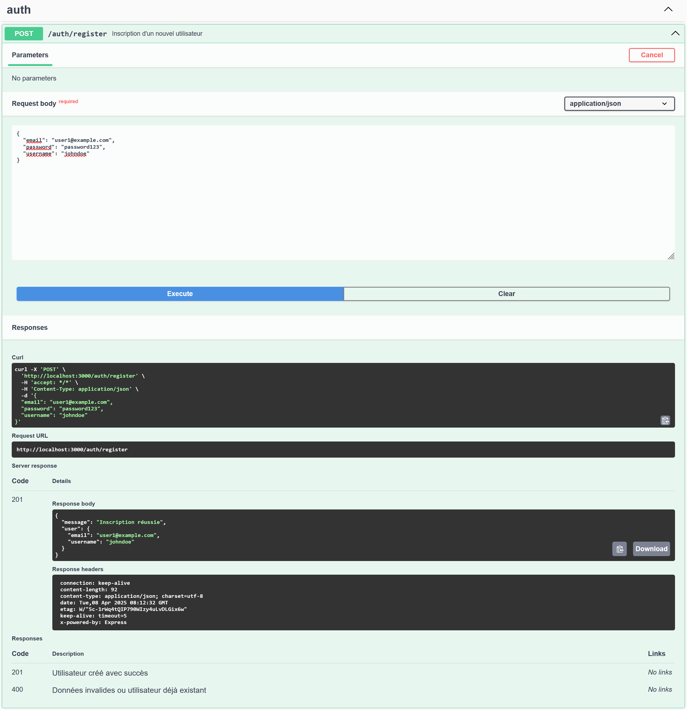
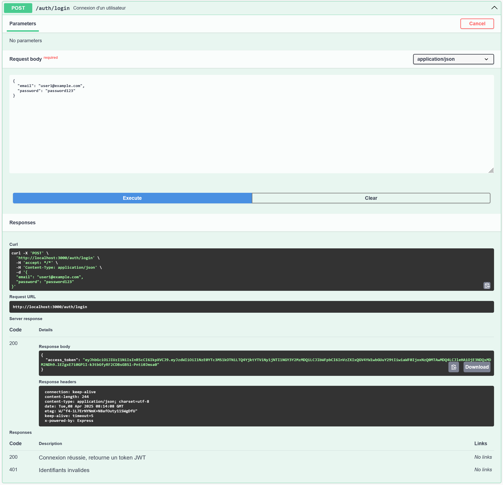
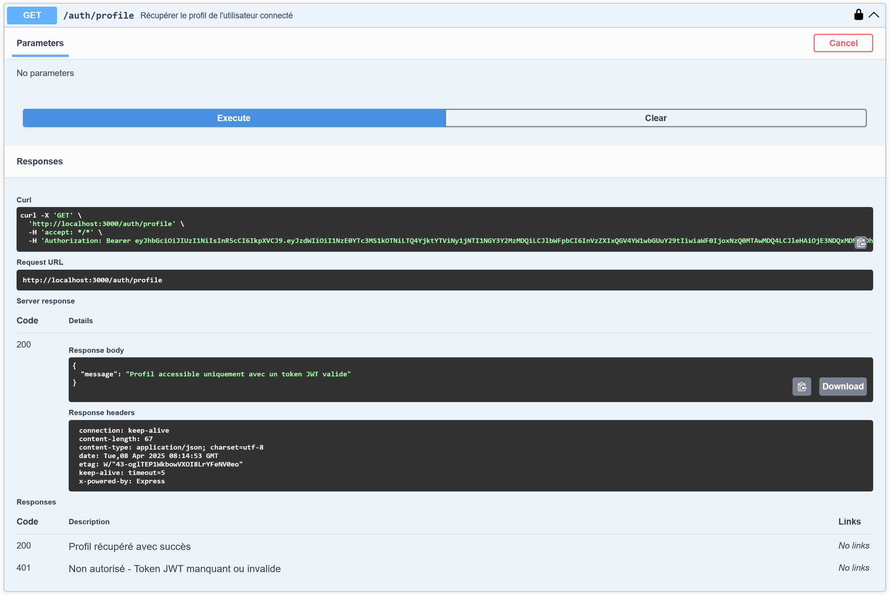
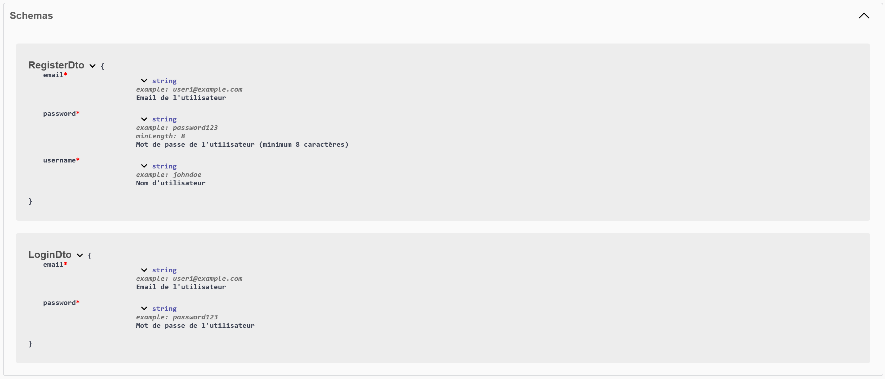
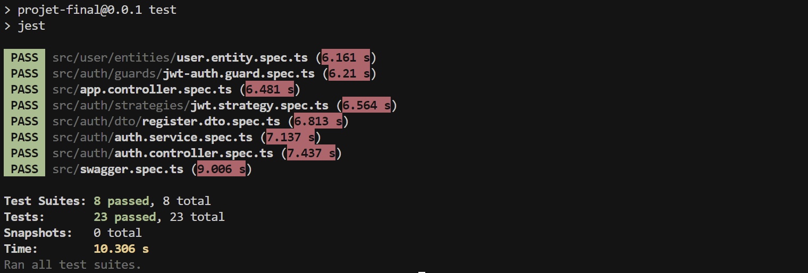

# MovieBooker

Projet Nest.js académique de reservation de films en ligne.

## Description

Ce projet contient plusieurs exercices afin de pratiquer et monter en compétences avec Nest.js.

### Exercices du jour 1 : [ICI](ExoJ1/)

Dans un premier temps, deux exercices ont été réalisés en JS natif.

Exercie d'authentification avec base64 :

- [Authentification.js](ExoJ1/filtrage.js)

Exercie de filtrage de tableau :

- [Filtrage.js](ExoJ1/filtrage.js)

Plus d'information sur les exercices [ICI](ExoJ1/README.md).

---

### Projet Nest.js Hello World : [ICI](hello-world/)

Nous avons initialiser un projet Nest.js "Hello World" afin d'analyser la structure type de ce projet.

Test de fonctionnement de l'application :

```bash
npm run start
```

Sur le port 3000, l'application affiche :

```bash
Hello World!
```

Pour comprendre la structure et le focntionnement :

Modification du message affiché depuis le fichier [app.service.ts](hello-world/src/app.service.ts) :

```TypeScript
@Injectable()
export class AppService {
  getHello(): string {
    return "Hello World Galaad!";
  }
}
```

Test fonctionnel réaliser depuis le fichier [app.controller.spec.ts](hello-world/src/app.controller.spec.ts) :

```TypeScript
describe('root', () => {
  it('should return "Hello World Galaad!"', () => {
    expect(appController.getHello()).toBe('Hello World Galaad!');
  });
});
```

```bash
npm run test
```

Résultat avant modification de app.service.ts :


Résultat fonctionnel une fois la mise à jour effectuée :


---

### Projet final Nest.js : [ICI](projet-final/)

Génération du projet Nest.js :

```bash
nest new projet-final
```

Nous avons implémenté un système d'authentification complet avec JWT dans notre projet.

#### Configuration initiale

Commencer par l'installation des dépendances nécessaires :

```bash
npm install @nestjs/jwt bcrypt @nestjs/passport passport passport-jwt @types/passport-jwt
npm install @nestjs/swagger swagger-ui-express
```

#### Création des endpoints d'authentification

Nous avons créé trois endpoints principaux Register, Login et Profile :

- **POST /auth/register** : Inscription d'un nouvel utilisateur
  - Validation des données avec class-validator
  - Hachage du mot de passe avec bcrypt
  - Sauvegarde en base de données PostgreSQL



- **POST /auth/login** : Connexion d'un utilisateur
  - Vérification des identifiants
  - Génération d'un token JWT



- **GET /auth/profile** : Route protégée nécessitant une authentification
  - Protection avec JWT Guard
  - Accessible uniquement avec un token valide



#### Documentation avec Swagger

Nous avons connecté le projet avec Swagger pour permettre de:

- Tester les endpoints directement depuis l'interface
- Voir les schémas de données attendu
- Comprendre les différente réponses possibles



#### Tests unitaires

Plusieurs tests unitaires ont été mises en place via les fichiers `.spec.ts`:

- Tests unitaires pour les DTOs
- Tests du service d'authentification
- Tests du contrôleur
- Tests de la stratégie JWT

Pour lancer les tests :

```bash
npm run test
```

Résultat des tests :



#### 5. Utilisation

1. Démarrer le serveur :

```bash
npm run start:dev
```

2. Accéder à la documentation Swagger :
   http://localhost:3000/api

---

## Ressources

### ExoJ1

- Lien d'aide pour Authentification.js : [www.digitalocean.com](https://www.digitalocean.com/community/tutorials/how-to-encode-and-decode-strings-with-base64-in-javascript).

### Projet Nest.js Hello World

- Lien d'aide pour prendre en main Nest.js : [nestjs.com](https://docs.nestjs.com/first-steps).

### Projet final Nest.js

- [Lien d'aide pour la partie authentification](https://www.linkedin.com/pulse/nestjs-app-authentication-login-signup-moaz-irfan).
- [Lien d'aide pour la partie authentification](https://pietrzakadrian.com/blog/nestjs-authentication-series/user-registration/).
